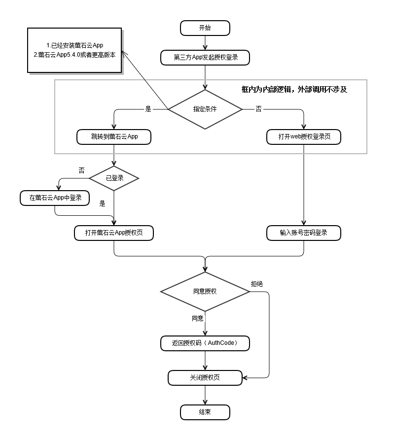

# 萤石通行证SDK使用说明

## 目录结构

**第1部分----------授权流程  
第2部分----------集成SDK  
第3部分----------使用示例  
第4部分----------参考资料**

## 产品说明

萤石通行证是萤石开放平台基于OAuth2.0协议推出的授权认证产品。通过使用萤石通行证，萤石开放平台客户可以实现，通过萤石云账号体系完成对用户身份的识别和鉴权。在萤石通行证SDK的功能上表现为，萤石开放平台客户可以通过集成萤石通行证SDK，实现类似于“被广泛使用的微信第三方登录”的**萤石第三方登录功能**。
通过使用**萤石第三方功能**，第三方终端用户在已经安装萤石云App的情况下，可以实现免密授权登录；在未安装萤石云App的情况下，可以实现输入萤石账号密码后的授权登录。

## 术语说明

| 术语             |                                         术语说明                                         |
| ---------------- | :--------------------------------------------------------------------------------------: |
| 第三方终端用户   |                 使用基于萤石开放平台产品开发的第三方产品的用户，如App。                  |
| 萤石开放平台客户 |              基于开放平台产品为第三方终端用户开发第三方产品的客户，如app。               |
| 授权码           | AuthCode，用于获取第三方终端用户在萤石账号体系中的身份信息，在用户同意授权时生成并返回。 |

### 1 授权流程

在您开始集成萤石通行证SDK之前，或者当您在开发过程中遇到疑问时，您可以通过以下流程图了解SDK整体的工作流程，以便您更好的了解和使用。  

  

一旦第三方App获取到授权码（AuthCode），第三方App就可以利用开放平台提供的Http接口完成用户身份识别和鉴权。为保证信息安全，此步骤建议在第三方服务端完成。

### 2 集成SDK

#### 2.0 准备环境

）安装**Android Studio 1.4或更高版本**  
）安装**JDK 1.7或更高版本**  
）确认Android手机版本高于**4.0**  

#### 2.1 获取SDK

在需要集成SDK的Android Studio工程的相应模块的**build.grale文件的dependencies节点下**添加如下配置，即可通过在线方式从Jcenter仓库获取到对应版本的SDK。

```groovy
 implementation 'com.ezviz.sdk:ezvizoauth:2.0.0'
```

#### 2.1 添加权限

**十分重要！开发前请添加以下权限到AndroidManifest.xml文件中。**

```xml
<uses-permission android:name="android.permission.INTERNET" />
```

#### 2.3 混淆代码

``` java
#========SDK对外接口=======#
-keep class com.ezviz.opensdk.oauth.** { *;}
-keep class com.ezviz.sdk.auth.** { *;}
```

当您正确完成以上步骤后，您就已经成功集成SDK，接下来可以开始使用SDK开发相关功能。

### 3 使用示例

**示例代码均使用kotlin编写。**

#### 3.1 初始化SDK

``` kotlin
        // 打开日志开关
        EzvizAuthSDK.showSdkLog(true)
        // 在发起授权必须先初始化SDK
        EzvizAuthSDK.init(applicationContext)
```

#### 3.2 发起授权请求

``` kotlin
        // 创建授权请求
        val request = EaAuthRequest.Builder()
                // 从官网开发者后台获取
                // 开放平台官网：https://open.ys7.com/
                .setAppkey(APP_KEY)
                // 默认：https://open.ys7.com
                .setAuthUrl(AUTH_URL)
                // 需与后台预留一致
                // 默认：default，则授权过程不校验该参数
                .setRedirectUrl("default")
                .build()

        // 创建授权回调
        private val listener = EaResultListener { resp ->
            Log.i("EzvizAuthSDK", "AuthCode is " + resp.authCode)
            // 获取到授权码后，您自己的处理逻辑
        }

        // 发起授权请求
        EzvizAuthSDK.getInstance().startAuthByYingShiAccount(request, listener)
```

#### 3.3 设置中间页

为处理来自萤石云App或web页面的授权结果，您需要在工程中添加特定规则的Activity，规则如下：  
）该Activity必须位于应用包名下的ezvizauth子包中。  
如文末demo所示，demo包名为com.ezviz.demo1，则AuthEntryActivity应位于com.ezviz.demo1.ezvizauth子包中。  
）该Activity必须名为AuthEntryActivity。  
）在此Activity的onCreate方法中调用如下代码。

```kotlin
        // 处理授权结果
        AuthManager.getInstance().handleAuthResponse(getIntent());
        // 关闭此Activity
        finish();
```

最后别忘记在AndroidManifest.xml文件中注册该Activity。  

### 4 参考资料

若文档有未尽之处，请参考以下资料。
1.萤石通行证SDK demo，[点击跳转到github下载](https://github.com/Ezviz-Open/EzvizAuthSDK-Android)
